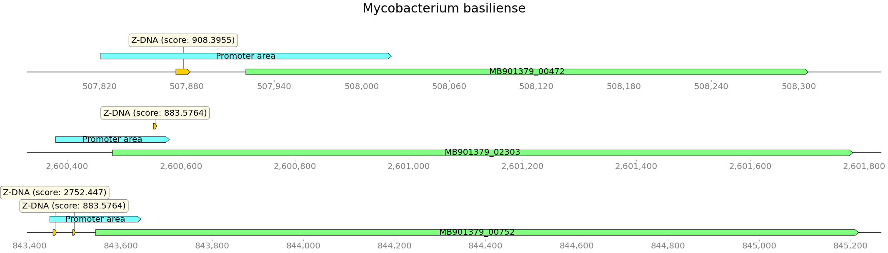
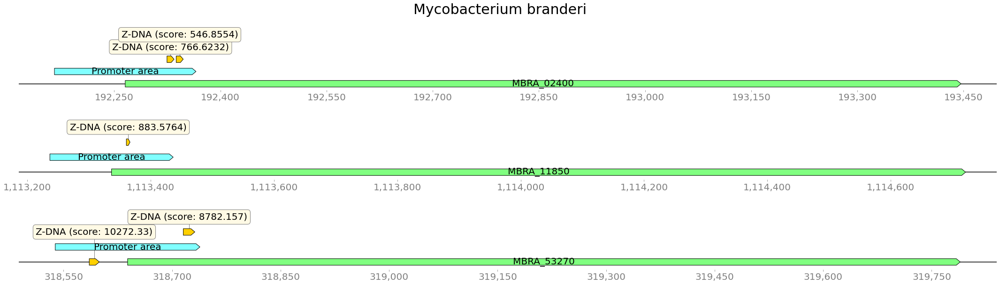
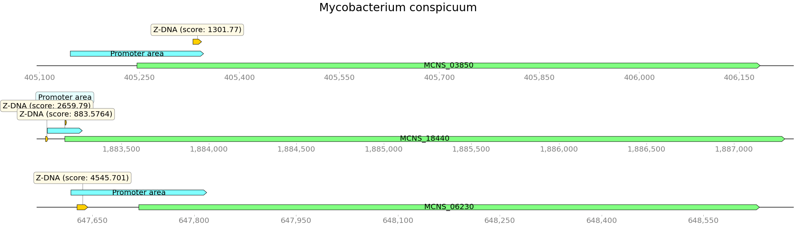
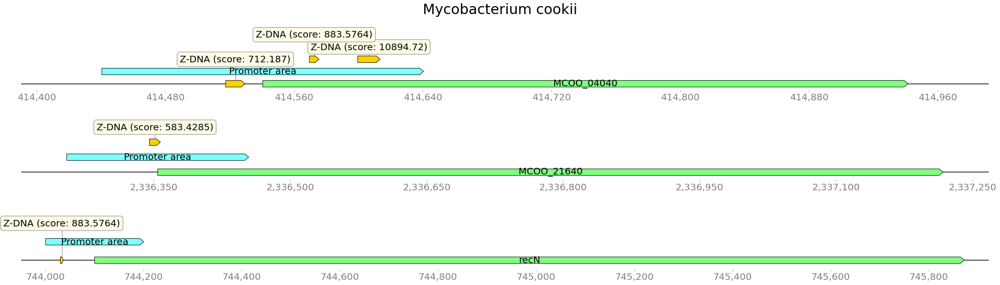
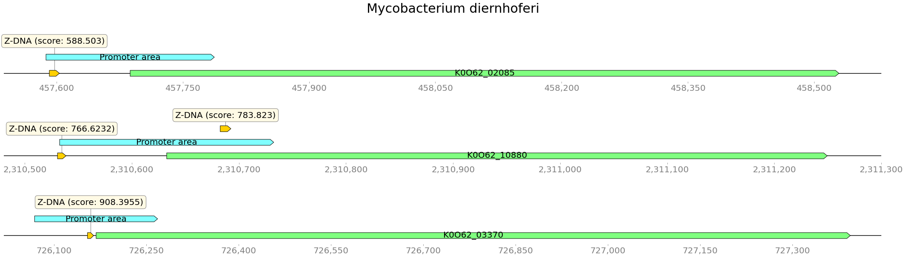
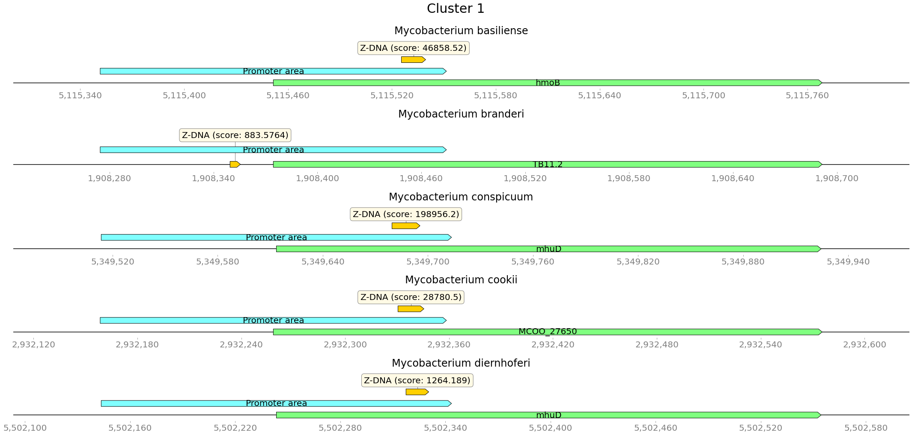
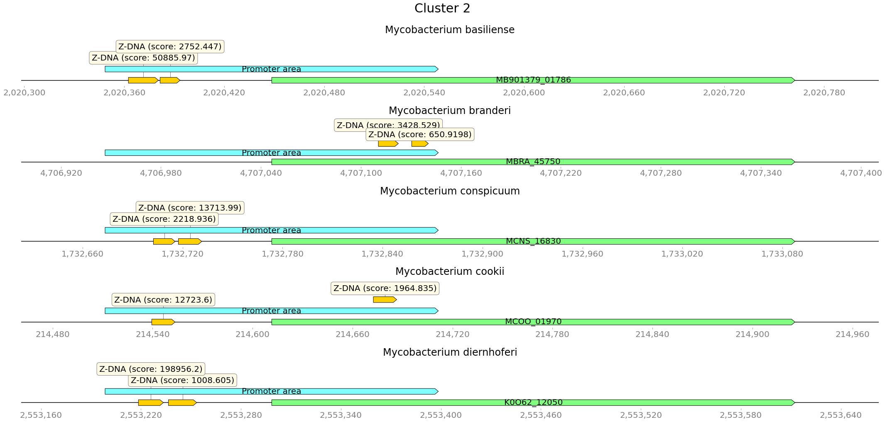
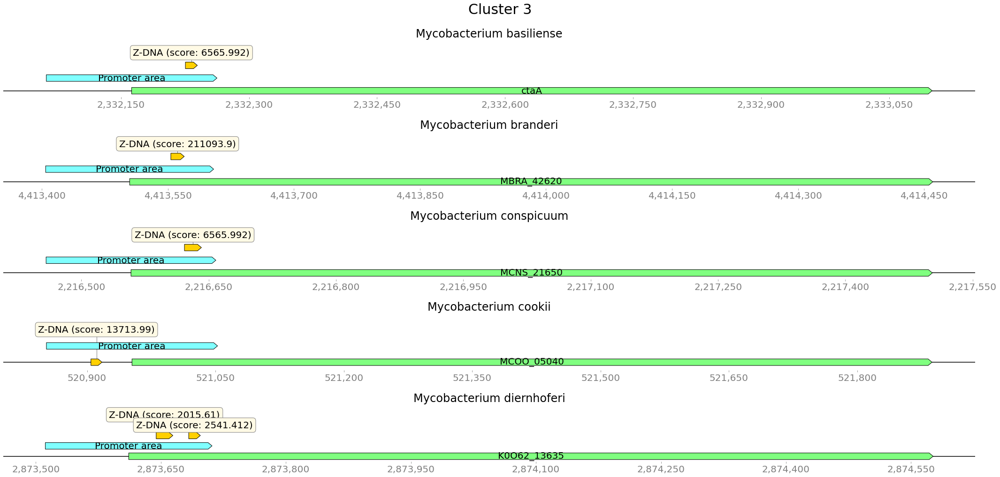
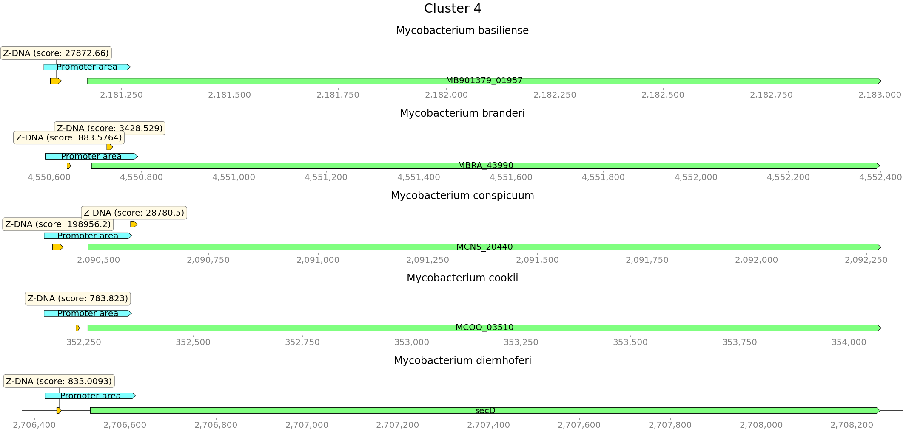
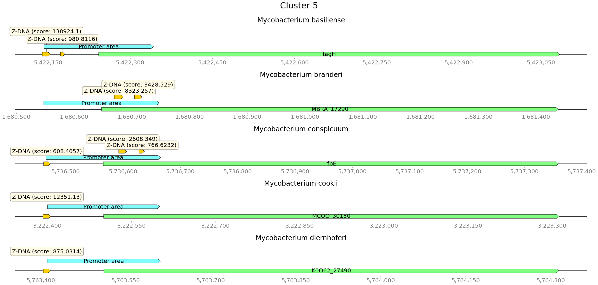

# HSE BioInf 2022 project

[Colab](https://colab.research.google.com/drive/1x_dEPJYpuTsx3fNG2vOzc2dPSlwk8iJo)

## Файлы

- [Mycobacterium basiliense](data/GCA_900292015.1)
- [Mycobacterium branderi](data/GCA_010728725.1)
- [Mycobacterium conspicuum](data/GCA_010730195.1)
- [Mycobacterium cookii](data/GCA_010727945.1)
- [Mycobacterium diernhoferi](data/GCA_019456655.1)

## Анализ аннотированных генов

Организм                  | Длина генома | Аннотированные гены | Покрытие генома аннотированными генами
--------------------------|--------------|---------------------|---------------------------------------
Mycobacterium basiliense  | 5607630      | 4886                | 0.9036
Mycobacterium branderi    | 5979623      | 5919                | 0.9283
Mycobacterium conspicuum  | 6237139      | 5847                | 0.9256
Mycobacterium cookii      | 5318517      | 5047                | 0.9274
Mycobacterium diernhoferi | 5998503      | 5643                | 0.9204

## Предсказание участков Z-DNA

### Все найденные участки

Организм                  | Участки Z-DNA | Общая длина участков Z-DNA
--------------------------|---------------|---------------------------
Mycobacterium basiliense  | 5607630       | 53483548
Mycobacterium branderi    | 5115366       | 48951724
Mycobacterium conspicuum  | 6237139       | 59845176
Mycobacterium cookii      | 5318517       | 50704654
Mycobacterium diernhoferi | 5998503       | 57874352

Предсказанные участки Z-DNA покрывают почти весь геном, но у большей части из них слишком низкий скор.

### ZH-Score >= 500
Организм                  | Участки Z-DNA | Общая длина участков Z-DNA
--------------------------|---------------|---------------------------
Mycobacterium basiliense  | 54295         | 536644
Mycobacterium branderi    | 60974         | 600654
Mycobacterium conspicuum  | 91668         | 905066
Mycobacterium cookii      | 57611         | 566130
Mycobacterium diernhoferi | 63890         | 634210

Отфильтрванные участки Z-DNA покрывают 10-15% генома

### Пересечения с промотерами

Организм                  | Количество пересечений
--------------------------|-----------------------
Mycobacterium basiliense  | 3129
Mycobacterium branderi    | 4394
Mycobacterium conspicuum  | 5046
Mycobacterium cookii      | 3444
Mycobacterium diernhoferi | 3869

С промотерами пересекается 5-8% отфильтрованных участков Z-DNA

Примеры пересечений:

## Гомологичные связи

[Результат работы proteinortho](data/02_proteinortho)

Найдено 2412 кластеров, которые включают гены из всех 5 геномов. Из них 204 - с Z-DNA в промотерах генов (см. колаб).

### Множественное выравнивание

[Результаты выравнивания](data/03_alignments) (в файлах `*.afa`)

### Визуализация

